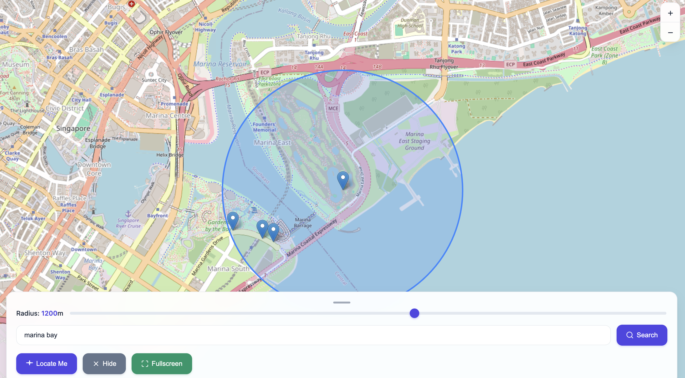

# SG Nearby Bus Stops

A modern web application that displays nearby bus stops in Singapore on an interactive map, built with vanilla JavaScript and Leaflet.

## Demo

https://yapweijun1996.github.io/Nearby-Bus-Stop-v2/

## Preview



## Features

-   **Locate Me**: Automatically detects and displays your current location on the map with high accuracy geolocation.
-   **Location Search**: Advanced search functionality with fuzzy matching and intelligent result ranking using Overpass API.
-   **Adjustable Radius**: Interactive radius slider (100m to 2000m) with real-time visual feedback and smooth animations.
-   **Bus Stop Details**: Click on bus stop markers to view detailed information including bus stop code, name, distance, and direct links to real-time arrival times.
-   **Fullscreen Mode**: Immersive fullscreen viewing experience for enhanced map exploration.
-   **Mobile Responsive**: Fully optimized for mobile devices with touch-friendly controls, responsive design, and safe area support.
-   **Modern UI**: Clean, modern interface with custom-styled popups, zoom controls, smooth animations, and glassmorphism effects.
-   **URL Sharing**: Share specific locations via URL parameters (e.g., `?lat=1.283&lon=103.860`).
-   **Performance Optimized**: Intelligent caching system with memory and localStorage for improved performance and reduced API calls.
-   **Accessibility**: Full keyboard navigation support, ARIA labels, screen reader compatibility, and high contrast mode support.
-   **Error Handling**: Comprehensive error handling with user-friendly messages and graceful fallbacks.
-   **Loading States**: Professional loading indicators with progress feedback and smooth transitions.

## Technologies

- **Frontend**: HTML5, CSS3, Vanilla JavaScript (ES6+)
- **Mapping**: [Leaflet](https://leafletjs.com/) - Open-source JavaScript library for interactive maps
- **Geocoding & Data**: [Overpass API](https://wiki.openstreetmap.org/wiki/Overpass_API) - Real-time OpenStreetMap data querying
- **Performance**: Multi-layer caching system (memory cache + localStorage) with intelligent cache management
- **APIs**: Modern Fetch API with comprehensive error handling and timeout management

## Data Source

Bus stop data is dynamically fetched in real-time using the [Overpass API](https://wiki.openstreetmap.org/wiki/Overpass_API), which queries OpenStreetMap data for Singapore including:
- Bus stop codes (ref tags)
- Bus stop names and descriptions
- Geographic coordinates (latitude and longitude)
- Real-time data availability

The application queries for `highway=bus_stop` and `public_transport=platform` nodes within the specified radius around the user's location, ensuring always up-to-date information without requiring manual data updates.

## Technical Implementation

### Architecture Overview

The application uses a modern, real-time architecture with dynamic data fetching and intelligent caching:

### Real-Time Data Fetching

**Overpass API Integration:**
- Queries OpenStreetMap data in real-time using the Overpass API
- Searches for `highway=bus_stop` and `public_transport=platform` nodes within specified radius
- Constructs intelligent regex patterns for fuzzy location matching
- Handles API timeouts and errors gracefully with user-friendly feedback

**Advanced Search System:**
- Implements fuzzy search with token-based pattern matching
- Supports partial word matching and intelligent result ranking
- Caches search results in localStorage for improved performance
- Debounced search requests to prevent API spam

### Multi-Layer Caching System

**Performance Optimizations:**
- **Memory Cache**: In-memory Map object for bus stop data with 5-minute expiry
- **localStorage Cache**: Persistent storage for search results and frequently accessed data
- **Debounced Operations**: 300ms debounce on radius changes, 500ms debounce on search
- **Request Deduplication**: Prevents duplicate API calls when already loading

**Cache Management:**
- Automatic cache size limits (50 entries for memory cache)
- Intelligent cache invalidation based on timestamps
- Graceful fallback when cache is unavailable

### Location Processing Logic

**User Location Detection:**
- Primary method: Browser Geolocation API with high accuracy settings
- Fallback method: URL parameters (`?lat=1.283&lon=103.860`)
- Default location: Singapore center coordinates (1.283, 103.860)
- Comprehensive error handling for different geolocation failure modes

**Bus Stop Filtering & Rendering:**
- Real-time filtering using Leaflet's distance calculation methods
- Dynamic marker creation with staggered animations for smooth UX
- Distance-based sorting for optimal user experience
- Automatic results counter with live updates

### Advanced Features Implementation

**Accessibility Features:**
- Full keyboard navigation support with proper focus management
- ARIA labels and live regions for screen readers
- High contrast mode support for users with visual impairments
- Reduced motion support for users with vestibular disorders

**Modern UI Features:**
- CSS custom properties (CSS variables) for consistent theming
- Glassmorphism effects with backdrop filters
- Smooth animations with cubic-bezier easing functions
- Mobile-first responsive design with safe area support

### Key Functions

**Core Functions:**
- `fetchBusStops(lat, lon, radius, callback)`: Fetches bus stop data from Overpass API
- `fetchBusStopsWithCache(lat, lon, radius, callback, cacheKey)`: Cached version with performance optimization
- `setUser(pos)`: Sets user location and triggers comprehensive updates
- `renderStops()`: Advanced filtering and rendering with animations
- `buildOverpassSearchQuery(query)`: Constructs intelligent search patterns
- `performSearch(query)`: Handles location search with caching and error handling

**Utility Functions:**
- `showLoadingState(message)`: Professional loading indicators with animations
- `showMessage(message, type)`: Advanced notification system with different types
- `normalizeOverpassElements(elements)`: Data processing and normalization
- `extractCoordinates(item)`: Robust coordinate extraction from various data formats

**User Interaction:**
- `locateMe()`: Enhanced geolocation with comprehensive error handling
- `searchLocation()`: Debounced search with intelligent result processing
- `loadStops()`: Initial data loading and application bootstrap

### Performance & Caching

**Intelligent Caching Strategy:**
- **Memory Cache**: Bus stop data cached in Map object with 5-minute expiry for instant subsequent loads
- **Search Cache**: Location search results cached in localStorage for 5 minutes to reduce API calls
- **Cache Management**: Automatic cleanup with size limits (50 entries) and intelligent invalidation
- **Offline Support**: Graceful degradation when network is unavailable

**Performance Optimizations:**
- **Debounced Operations**: 300ms debounce on radius slider, 500ms debounce on search input
- **Request Deduplication**: Prevents multiple simultaneous API calls for the same data
- **Staggered Animations**: Smooth marker animations with 50ms delays to prevent UI blocking
- **Efficient DOM Updates**: Minimal DOM manipulation with batch updates where possible

**API Rate Limiting:**
- Built-in protection against API spam with intelligent request timing
- Automatic retry logic with exponential backoff for failed requests
- Comprehensive error handling with user-friendly feedback messages

## Installation & Usage

### Running Locally

1. Clone or download this repository.
2. Open `index.html` in a modern web browser.
3. Grant location permissions when prompted to see nearby bus stops.
4. Use the search bar to find specific locations.
5. Adjust the radius slider to control the search distance.
6. Click on bus stop markers for detailed information.

### URL Parameters

You can share specific locations by appending coordinates to the URL:
```
https://yapweijun1996.github.io/Nearby-Bus-Stop-v2/?lat=1.283&lon=103.860
```

## Privacy & Permissions

This application requires geolocation permissions to:
- Automatically center the map on your current location
- Display nearby bus stops based on your position

Location data is processed locally in your browser and is not stored or transmitted to external servers.

## Business Use

This application is suitable for personal and non-commercial use. For business or high-traffic applications, please be aware that it relies on the free [Overpass API](https://wiki.openstreetmap.org/wiki/Overpass_API) for real-time bus stop data, which has a [usage policy](https://operations.osmfoundation.org/policies/nominatim/) that should be respected. The application implements intelligent caching and request optimization to minimize API load.

For high-volume commercial deployments, consider:
- Implementing your own OpenStreetMap data processing pipeline
- Contributing to OpenStreetMap infrastructure improvements
- Using commercial map data providers as alternatives

## License

This project is licensed under the MIT License. See the [LICENSE](LICENSE) file for details.
